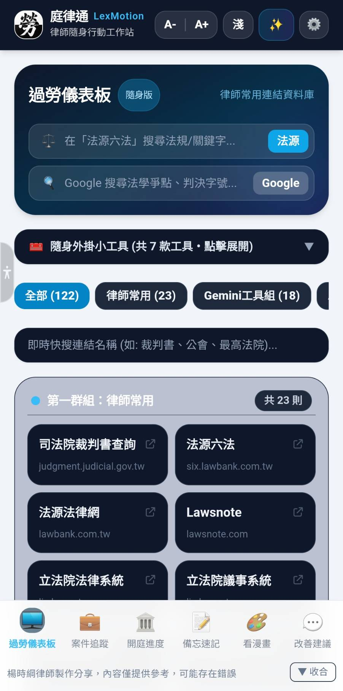
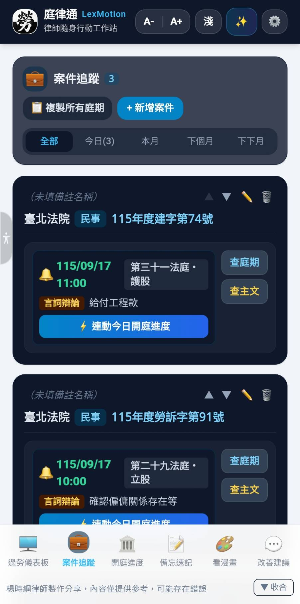
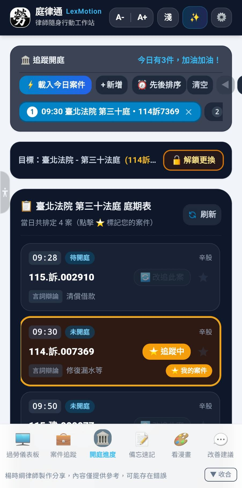
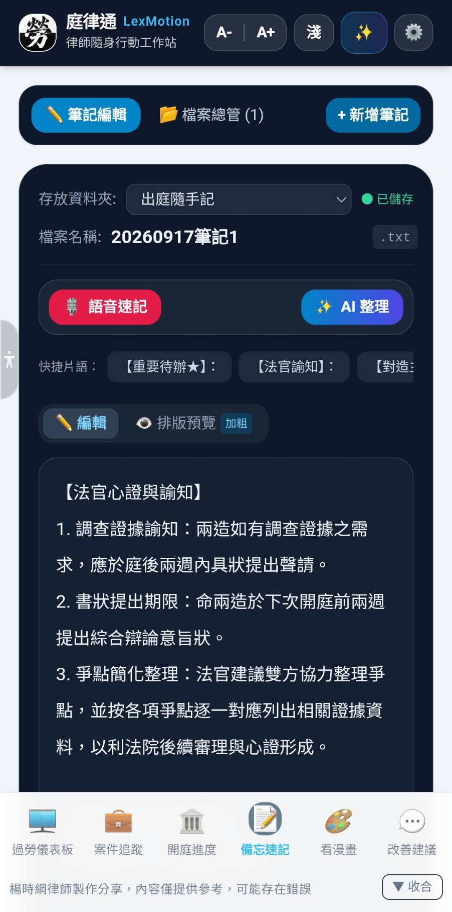
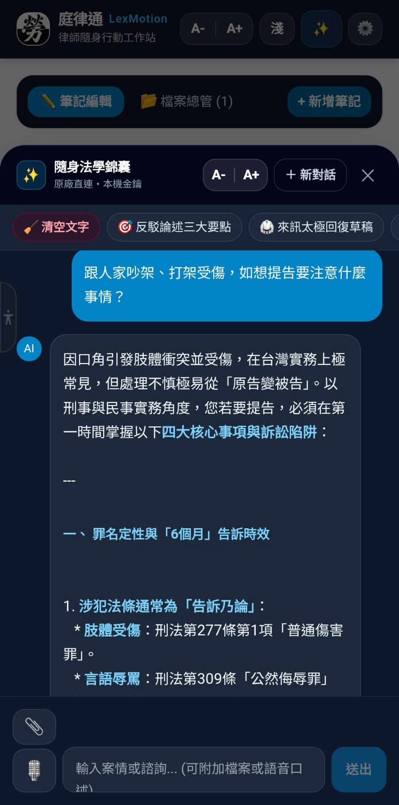
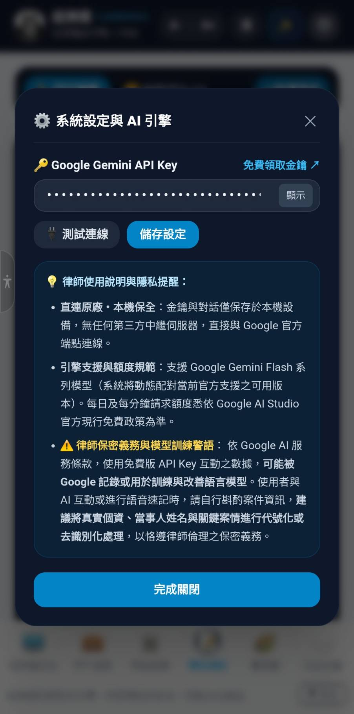

# 🏛️ 庭律通 (LexMotion) - 臺灣律師隨身行動工作站

> **專為臺灣執業律師與訴訟從業人員量身打造的極速、純本機、零廣告隨身出庭助理**  
> *開發製作：楊時綱律師 免費製作分享*

---

### 📱 正式發布版 (v2.0 Release APK)

  

---

## 🌟 軟體簡介與核心特點

「庭律通（LexMotion）」旨在協助律師同仁在各大法院、檢察署出庭、閱卷、等候開庭時，擁有最敏捷的隨身助理，告別「法庭門口擠著看螢幕」、「開庭翻找股別手忙腳亂」的高壓痛點。

* 🔒 **100% 純本機私密存儲**：無外部中央資料庫，所有受任案件資訊、開庭筆記全數保存在您的手機內部專屬儲存區，守護律師業務機密。
* ⚡ **司法院即時開庭看板**：同步司法院各級法院即時開庭號碼，支援「一鍵鎖定防誤觸」與單鍵刷新。
* 📋 **輕量卡片化案件追蹤**：掌握承辦股別、案號、對造當事人、開庭期日，支援「一鍵跳轉查庭期」與即時「查宣判主文」。
* 📝 **出庭大字備忘速記**：隨點隨寫安全存檔，支援「語音速記直轉文字」與資料夾分類，開庭完畢「一鍵複製純文字」直貼 LINE / Email。
* ✨ **隨身法學錦囊（AI 智慧對話）**：抽屜式面板隨手喚醒，支援快捷訴訟情境推演、語音口述與書狀照片辨識，個人免費 API Key 直連官方，隱私絕不外洩。
* 🧮 **舒適大字版法律速算機**：單手舒適推算遲延利息（年息 5%）、訴訟標的與比例分配，算完一鍵複製帶入書狀。
* 🎨 **護眼三態情境模式**：支援「深（暗光閱卷）」、「淺（日間商務）」與「米（經典牛皮紙護眼）」，並支援 [A-] / [A+] 全域字級一秒縮放。

---

## 📸 App 介面展示 (Screenshots)

| 📊 過勞儀表板（司法捷徑） | 📋 案件追蹤卡片（期日掌握） | 🏛️ 開庭進度（即時跳號看板） |
| :---: | :---: | :---: |
|  |  |  |

| 📝 出庭備忘速記（隨點即存） | ✨ 隨身法學錦囊（AI顧問對話） | ⚙️ 系統設定與隱私保全 |
| :---: | :---: | :---: |
|  |  |  |

---

## 🚀 第一次安裝指南（約需 30 秒）

1. **點擊上方綠色按鈕**下載 `庭律通-LexMotion-v2.0-release.apk` 安裝檔。
2. 在手機下載清單或檔案管理員中點擊該檔案進行安裝。
3. 若手機系統彈出「是否允許安裝來自此來源的未知應用程式？」提示，請點選 **「允許」** 或 **「設定 ➔ 開啟信任此來源」** 即可完成。

> ⚠️ **特別提醒（若安裝提示「套件衝突」）**：  
> 若您手機先前曾安裝過開發測試版（Debug 版），因正式版採用專屬正式金鑰簽名，系統安全機制會阻擋覆蓋。  
> **排除方式**：請先將手機桌面上的舊版圖示長按「解除安裝（刪除）」，再點擊安裝新版 APK 即可順利成功！

---

## 💼 出庭實務五大情境指南

### 【情境一：抵達法院，在法庭門外等候開庭】
👉 點擊下方 **【開庭進度】**：
1. 挑選您當天出庭的法院與院區（例如：臺灣高等法院、臺北地院民事庭）。
2. 輸入法庭編號（例如：第 7 法庭）。
3. 點擊「查詢今日開庭」，同步檢視目前法庭正在進行的即時案號與開庭清單，不用擠在門口抬頭看螢幕。
4. **防誤觸秘訣**：點擊「🔒 鎖定並更新」，鎖定輸入框避免手機放口袋或手持滑動時誤觸換庭；在法庭外只要單鍵點擊「🔄 刷新進度」即可拉取最新開庭號碼。

### 【情境二：隨身掌握受任案件、案號股別與待辦任務】
👉 點擊下方 **【案件追蹤】**：
1. 點擊「＋ 新增案件卡」，將手邊受任案件的案由、股別、案號、對造姓名、期日輸入卡片。
2. **一鍵跳轉查庭期**：開庭當天抵達法院時，在該案卡片上點擊「跳轉追蹤」圖示，系統將自動帶入該案的法院與法庭號碼，直接開啟即時看板，完全不必手動重打！
3. **查宣判主文**：追蹤案件如果已經宣判，點選「查主文」即會呈現判決主文。

### 【情境三：開庭即時速記待辦事項】
👉 點擊下方 **【備忘速記】**：
1. 極簡大字編輯介面，出庭隨點隨寫，文字鍵入時即時安全保存在手機本機，不怕忘記存檔。
2. **支援語音速記**：以說話方式直接交由 AI 轉成文字，省去手動打字煩惱。
3. 庭期結束後，點擊「📋 一鍵複製純文字」，即可快速貼進事務所通訊群組或 Email 回報委任當事人。
4. **案件資料夾分類**：點選上方檔案總管，可以透過民事、刑事等資料夾分類速記檔案。

### 【情境四：候庭攻防推演、當事人白話通報與 AI 智慧諮詢】
👉 點擊頂部 **【✨ 隨身法學錦囊】**：
1. **專屬隨身法學顧問隨手喚醒**：
   - 點擊螢幕頂部右上方「✨」按鈕，立即由下方滑出抽屜式 AI 對話面板，不中斷手邊正在查看的案件或庭期。
   - 只要設定 Google AI Studio 的免費 API KEY 就可使用（不生費用負擔）。
   - 免費 API KEY 可能會碰到流量尖峰呼叫失敗的回覆，可考慮重複詢問提升成功機率。
2. **內建實戰訴訟快捷情境**：
   - 橫向滑動上方快捷膠囊，一鍵帶入精選提示詞：
     •「🎯 反駁論述三大要點」：迅速針對特定論述擬定反擊架構。
     •「💬 當事人白話通報」：剛開完庭，秒將艱澀庭訊進度轉化為溫暖專業的 LINE 訊息。
     •「🥋 來訊太極回復草稿」：面對棘手來訊，快速生成得體有分寸的太極應對文字。
3. **支援多模態分析與語音輸入**：
   - 【📎 附檔辨識】：點擊左下角迴紋針，可附加書狀照片、判決截圖或 PDF 檔案進行即時分析。
   - 【🎙️ 長句語音直錄】：點擊麥克風口述案情，AI 自動語音轉文字輸入對話框。
4. **隱私第一與免費額度**：
   - 採用個人本機金鑰直連 Google 官方 AI 端點，對話內容不上傳第三方伺服器，受任業務機密 100% 自主掌控，且享每日個人大量免費額度。

### 【情境五：司法網站速查、調解速算、候庭放鬆與建議回饋】
👉 點擊下方 **【過勞儀表板】**、**【看漫畫】** 或 **【改善建議】**：
1. **【過勞儀表板】**：提供諸多常用網頁連結，並加以分類，點選即得，不必再四處尋找；亦整合簡易法律速算機。
2. **【看漫畫】**：內建過勞律師原創四格漫畫，在緊湊高壓的訴訟日常中，給您片刻幽默放鬆。
3. **【改善建議】**：若在使用過程中有任何改進想法或遇到問題，可點選開啟線上回報表單。

---

## ❓ 常見問題與排除 (FAQ)

**Q1：為什麼手機安裝時顯示「未知的應用程式，可能具有風險」？**  
A1：這是 Android 系統在手動安裝非 Google Play 來源 APK 時的通用標準防護提示。本軟體由楊時綱律師自製免費分享，絕無任何惡意程式或廣告外掛，請安心點選「允許」或「更多資訊 ➔ 仍要安裝」。

**Q2：安裝時提示「安裝失敗，套件與現有套件衝突」？**  
A2：這代表您手機上先前安裝過舊的測試版。請先在桌面長按舊版圖示「解除安裝」，再重新點擊安裝此正式發布版 APK 即可。

**Q3：司法院開庭看板偶爾顯示連線逾時？**  
A3：司法院系統每日深夜至清晨常進行例行伺服器維護；開庭即時跳號主要於法院上班開庭時間（平日 09:00～17:30）依各法庭實際點呼進度跳號更新。若遇離峰或維護時段，稍候刷新重試即可。

**Q4：我輸入的案件或筆記會被外部看見嗎？**  
A4：絕對不會。本工具完全採用本機隔離儲存，無任何雲端伺服器接收您的資料，請放心使用。

---

## 📜 軟體版本與免責聲明

* **軟體名稱**：庭律通（LexMotion）
* **軟體版本**：v2.0 正式發布版 (Release APK)
* **適用環境**：Android 8.0 (API 26) 以上智慧型手機與平板
* **開發作者**：楊時綱律師 製作分享

### 【免責聲明】
本軟體係由楊時綱律師基於法律實務同行交流互助之熱忱，免費製作分享供各界同仁參考使用，不收取任何費用。

軟體內容與各項功能僅供日常出庭輔助參考，可能存在錯誤或未盡完善之處。軟體內所呈現之即時開庭進度、期日與公告資料均介接自司法院公開端點，實際之開庭順序、點呼時間、審判主文及個案進度，仍應一律以各該管轄法院法庭當日實際點呼、承審法官書記官宣告以及正式裁判書送達為準。

---

### 💬 同行指教與改善回饋
若您在使用過程中有任何寶貴指教或改進建議，歡迎透過 App 內「💬 改善建議」按鈕，或至線上表單留言回饋：  
👉 [楊時綱律師線上改善建議表單](https://karolushi.netlify.app/#contact)

**祝各位道長 出庭順心・案件勝訴！**
